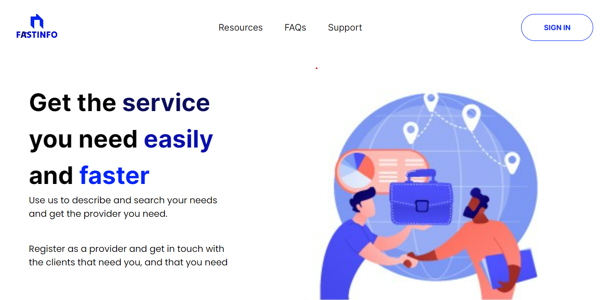

# FASTINFO



Sometimes you may have a business or organisation , but people that need your services don’t know that your business or organisation exists, and people might need to work in or for your business but they don’t know if it is possible at the moment.

FastInfo is a website project that offers information about various organisations, including schools, markets, private hospitals,small business, companies , shops, and more. Organisations register themselves and post essential information for individuals considering working with them for the first time. The issue is that people may not be aware of whether a particular service they need exists or not. Organisations always need to communicate to the world that they are capable of satisfying people's needs. This is good because it  make advertisement easily

People spend a lot of time   searching for specific services because they don’t know where the services are still available.

We also help small businesses and entrepreneurs to get known easily without the need for advertisement which is expensive.


## TECHNOLOGIES USED

- React JS
- Node JS
- Express JS
- Talwind CSS
- React Native
- Google Map API
- MongoDB / MySQL
- AI

## INSTALLATION

To get started with the project, follow these steps:

1. **Clone the Repository**: Clone the repository to your local machine using Git:

    ```bash
    git clone https://github.com/NICOLA-200/FastInfo.git
    ```

2. **Navigate to the Project Directory**: Change your current directory to the project directory:

    ```bash
    cd FastInfo/frontend
    ```


3. **Install Dependencies**: Install project dependencies using npm or yarn:

    ```bash
    npm install
    ```

    Or, with yarn:

    ```bash
    yarn
    ```

4. **Start the Development Server**: Start the development server to run the project locally:

    ```bash
    npm run dev
    ```

    Or, with yarn:

    ```bash
    yarn dev
    ```

5. **View in Browser**: Once the development server is running, open your web browser and navigate to the following URL:

    ```
    http://localhost:5173
    ```

    This will display the project in your browser, allowing you to interact with it locally.

6. **Explore and Modify**: You're all set! Feel free to explore the project and make any modifications you like. As you make changes to the code, the development server will automatically update, allowing you to see your changes reflected in real-time in the browser.

By following these steps, you should be able to install and set up the project on your local machine, and view it in your browser.

## Support

If you encounter any issues or have any questions, feel free to reach out for support:

- **Documentation**: Check out the [Whole Readme](https://github.com/NICOLA-200/FastInfo/blob/main/readme.md) for more information about the project.

- **Issues**: If you find a bug or have a feature request, please open an [issue](https://github.com/NICOLA-200/FastInfo/issues) on GitHub.

- **Email**: You can also email us at fastinfo.experts@gmail.com for further assistance.

- **Twitter**: Follow us on [Twitter](https://twitter.com/Unknown_TNTL) for updates and announcements.

We're here to help! Don't hesitate to reach out if you need assistance with anything related to the project.